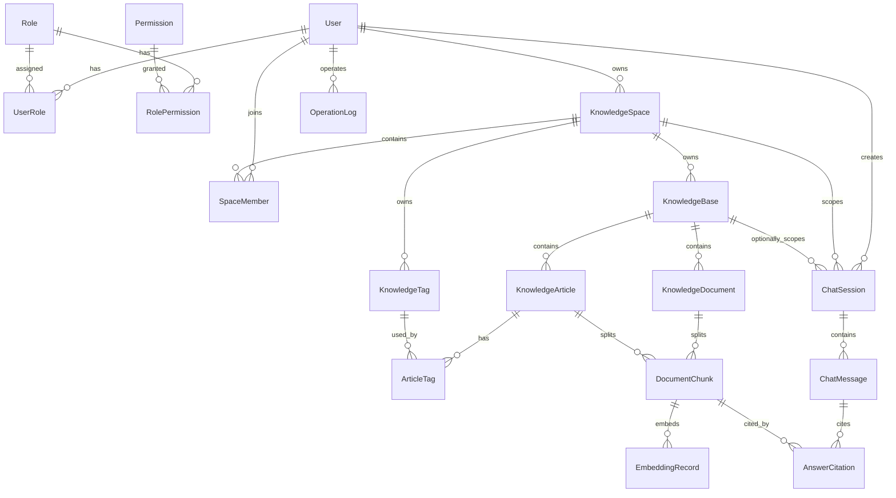

# Oxygen 智能知识库平台实体关系设计

## 实体关系图



## 命名和字段约定

### 表命名

- 系统权限表使用 `sys_` 前缀。
- 知识业务表使用 `knowledge_` 前缀。
- Agent 会话表使用 `chat_` 前缀。
- 日志表使用 `operation_log`。

### 通用字段

核心业务表统一包含：

| 字段 | 类型 | 说明 |
| --- | --- | --- |
| `id` | `BIGINT` | 主键，自增 |
| `create_time` | `DATETIME` | 创建时间，数据库默认当前时间 |
| `update_time` | `DATETIME` | 更新时间，数据库自动更新 |
| `deleted` | `TINYINT` / `BOOLEAN` | 逻辑删除预留字段，当前业务暂不使用 |

说明：

- `create_time`、`update_time` 由数据库默认值维护。
- `last_login_time` 不要在注册时设置，只在登录成功后更新。
- Entity 中使用 `LocalDateTime` 映射时间字段。
- `deleted` 字段保留在数据库和 Entity 中，当前接口不按它过滤，也不通过它删除数据。

### 枚举字段约定

实体文档中的状态、角色、可见性字段采用下面的存储方式：

```text
数据库：VARCHAR(32)，保存枚举名称，如 PRIVATE、PUBLIC
Java DTO / Entity：使用 enum
前端 JSON：传字符串，如 "PRIVATE"
```

Java 业务代码不手写字符串：

```java
// 错误写法
private String visibility;
```

使用枚举：

```java
public enum SpaceVisibility {
    PRIVATE,
    PUBLIC
}
```

```java
private SpaceVisibility visibility;
```

说明：

- MySQL 不使用数据库原生 `ENUM` 类型，使用 `VARCHAR(32)` 更方便扩展。
- `visibility` 只表示“资源对谁可见”，不表示“谁能编辑”。
- 编辑、删除、成员管理等操作权限由 scoped RBAC 判断。

## 用户权限实体

### User 用户

表名：`sys_user`

用户表表示所有能登录系统的人。普通用户、系统管理员都属于用户，区别来自绑定的角色和权限。

| 字段 | 类型 | 必填 | 说明 |
| --- | --- | --- | --- |
| `id` | `BIGINT` | 是 | 用户 ID |
| `username` | `VARCHAR(64)` | 是 | 登录账号，唯一 |
| `password` | `VARCHAR(255)` | 是 | BCrypt 加密后的密码 |
| `nickname` | `VARCHAR(64)` | 是 | 昵称 |
| `email` | `VARCHAR(128)` | 否 | 邮箱，唯一 |
| `phone` | `VARCHAR(32)` | 否 | 手机号，唯一 |
| `avatar` | `VARCHAR(255)` | 否 | 头像地址 |
| `status` | `VARCHAR(32)` | 是 | 用户状态：`DISABLED`、`ACTIVE` |
| `last_login_time` | `DATETIME` | 否 | 最后登录时间 |
| `create_time` | `DATETIME` | 是 | 创建时间 |
| `update_time` | `DATETIME` | 是 | 更新时间 |
| `deleted` | `TINYINT` | 是 | 逻辑删除预留字段，当前业务暂不使用 |

索引：

- `uk_sys_user_username(username)`
- `uk_sys_user_email(email)`
- `uk_sys_user_phone(phone)`

Entity：`User`

注意：

- `password` 只存在 Entity 和数据库中，不允许出现在 VO。
- 注册成功后默认绑定 `MEMBER` 角色。
- 初始化系统时需要创建一个 `SYSTEM_ADMIN` 用户。

### Role 角色

表名：`sys_role`

角色是一组权限的集合，使用 `scope_type` 区分全局角色和空间 scope 角色。

| 字段 | 类型 | 必填 | 说明 |
| --- | --- | --- | --- |
| `id` | `BIGINT` | 是 | 角色 ID |
| `role_code` | `VARCHAR(64)` | 是 | 角色编码，唯一，如 `SYSTEM_ADMIN` |
| `role_name` | `VARCHAR(64)` | 是 | 角色名称 |
| `scope_type` | `VARCHAR(32)` | 是 | 角色适用范围：`GLOBAL`、`SPACE`，未来可扩展 `KB`、`PAGE` |
| `description` | `VARCHAR(255)` | 否 | 角色说明 |
| `status` | `VARCHAR(32)` | 是 | 状态：`DISABLED`、`ACTIVE` |
| `create_time` | `DATETIME` | 是 | 创建时间 |
| `update_time` | `DATETIME` | 是 | 更新时间 |
| `deleted` | `TINYINT` | 是 | 逻辑删除预留字段，当前业务暂不使用 |

V1 全局角色：

| 角色编码 | 说明 |
| --- | --- |
| `SYSTEM_ADMIN` | 系统管理员，拥有全部系统级权限 |
| `MEMBER` | 普通注册用户，拥有基础使用权限 |

V1 空间 scope 角色：

| 角色编码 | 说明 |
| --- | --- |
| `SPACE_OWNER` | 空间拥有者，拥有该空间全部权限 |
| `SPACE_ADMIN` | 空间管理员，可管理成员、知识库、文档、条目 |
| `SPACE_EDITOR` | 编辑者，可创建和编辑条目、上传文档 |
| `SPACE_VIEWER` | 查看者，只能查看知识和向 Agent 提问 |

扩展角色：

| 角色编码 | 说明 |
| --- | --- |
| `USER_ADMIN` | 用户管理员，只管理用户和角色 |
| `AUDITOR` | 审计管理员，只查看操作日志 |

### Permission 权限

表名：`sys_permission`

权限表示一个操作能力。全局权限可映射为 Spring Security 的 `GrantedAuthority`，空间权限通过 `scope_type + scope_id` 校验。

| 字段 | 类型 | 必填 | 说明 |
| --- | --- | --- | --- |
| `id` | `BIGINT` | 是 | 权限 ID |
| `permission_code` | `VARCHAR(128)` | 是 | 权限编码，唯一，如 `user:view` |
| `permission_name` | `VARCHAR(64)` | 是 | 权限名称 |
| `resource_type` | `VARCHAR(32)` | 是 | 资源类型，如 `USER`、`ROLE`、`SPACE`、`AUDIT`、`DASHBOARD` |
| `description` | `VARCHAR(255)` | 否 | 权限说明 |
| `status` | `VARCHAR(32)` | 是 | 状态：`DISABLED`、`ACTIVE` |
| `create_time` | `DATETIME` | 是 | 创建时间 |
| `update_time` | `DATETIME` | 是 | 更新时间 |
| `deleted` | `TINYINT` | 是 | 逻辑删除预留字段，当前业务暂不使用 |

V1 权限：

| 权限编码 | 说明 |
| --- | --- |
| `user:view` | 查看用户 |
| `user:create` | 创建用户 |
| `user:update` | 修改用户 |
| `user:delete` | 删除用户 |
| `role:manage` | 管理角色 |
| `permission:manage` | 管理权限 |
| `space:create` | 创建知识空间 |
| `space:view` | 查看知识空间 |
| `space:update` | 修改知识空间 |
| `space:delete` | 删除知识空间 |
| `member:view` | 查看空间成员 |
| `member:manage` | 管理空间成员 |
| `kb:view` | 查看知识库 |
| `kb:create` | 创建知识库 |
| `kb:update` | 修改知识库 |
| `kb:delete` | 删除知识库 |
| `article:view` | 查看知识条目 |
| `article:create` | 创建知识条目 |
| `article:update` | 修改知识条目 |
| `article:delete` | 删除知识条目 |
| `article:publish` | 发布或下线知识条目 |
| `document:view` | 查看文档 |
| `document:manage` | 管理文档 |
| `tag:manage` | 管理标签 |
| `audit:view` | 查看审计日志 |
| `dashboard:view` | 查看后台统计 |

说明：

- `SYSTEM_ADMIN` 在 `GLOBAL` 下拥有全部权限，可穿透空间 scope。
- 普通用户在 `GLOBAL` 下只保留基础入口权限，例如 `space:create`。
- 空间内权限通过 `sys_user_role(scope_type='SPACE', scope_id=space_id)` 授予。

### UserRole 用户角色关联

表名：`sys_user_role`

| 字段 | 类型 | 必填 | 说明 |
| --- | --- | --- | --- |
| `id` | `BIGINT` | 是 | 关联 ID |
| `user_id` | `BIGINT` | 是 | 用户 ID |
| `role_id` | `BIGINT` | 是 | 角色 ID |
| `scope_type` | `VARCHAR(32)` | 是 | 授权范围：`GLOBAL`、`SPACE`，未来可扩展 |
| `scope_id` | `BIGINT` | 否 | 授权范围 ID；`GLOBAL` 时为空，`SPACE` 时为 `knowledge_space.id` |
| `create_time` | `DATETIME` | 是 | 创建时间 |

约束：

- 唯一索引：`uk_user_role_scope(user_id, role_id, scope_type, scope_id)`
- 外键开发期使用，正式项目也保留逻辑关联。

示例：

```text
user_id=1, role=SYSTEM_ADMIN, scope_type=GLOBAL, scope_id=null
user_id=2, role=SPACE_EDITOR, scope_type=SPACE, scope_id=100
```

### RolePermission 角色权限关联

表名：`sys_role_permission`

| 字段 | 类型 | 必填 | 说明 |
| --- | --- | --- | --- |
| `id` | `BIGINT` | 是 | 关联 ID |
| `role_id` | `BIGINT` | 是 | 角色 ID |
| `permission_id` | `BIGINT` | 是 | 权限 ID |
| `create_time` | `DATETIME` | 是 | 创建时间 |

约束：

- 唯一索引：`uk_role_permission(role_id, permission_id)`

## 知识空间实体

### KnowledgeSpace 知识空间

表名：`knowledge_space`

知识空间是权限隔离的最大业务边界，是一个团队、课程、项目组或专题空间。

| 字段 | 类型 | 必填 | 说明 |
| --- | --- | --- | --- |
| `id` | `BIGINT` | 是 | 空间 ID |
| `space_name` | `VARCHAR(128)` | 是 | 空间名称 |
| `space_code` | `VARCHAR(64)` | 是 | 空间编码，唯一 |
| `description` | `VARCHAR(500)` | 否 | 空间说明 |
| `visibility` | `VARCHAR(32)` | 是 | 可见性，Java 使用 `SpaceVisibility`：`PRIVATE`、`PUBLIC` |
| `owner_id` | `BIGINT` | 是 | 空间拥有者用户 ID |
| `status` | `VARCHAR(32)` | 是 | 状态：`DISABLED`、`ACTIVE` |
| `create_time` | `DATETIME` | 是 | 创建时间 |
| `update_time` | `DATETIME` | 是 | 更新时间 |
| `deleted` | `TINYINT` | 是 | 逻辑删除预留字段，当前业务暂不使用 |

索引：

- `uk_knowledge_space_code(space_code)`
- `idx_knowledge_space_owner(owner_id)`

业务规则：

- 创建空间的人自动成为空间成员，并获得 `SPACE_OWNER @ SPACE:{spaceId}`。
- `SYSTEM_ADMIN` 能管理全部空间。
- 普通用户只能看到自己加入的空间和公开空间。
- `visibility` 只控制能否看到空间入口，不控制空间内编辑权限。

### SpaceMember 空间成员

表名：`knowledge_space_member`

空间成员表表示某个用户是否属于某个知识空间，不作为权限来源。

| 字段 | 类型 | 必填 | 说明 |
| --- | --- | --- | --- |
| `id` | `BIGINT` | 是 | 成员关系 ID |
| `space_id` | `BIGINT` | 是 | 空间 ID |
| `user_id` | `BIGINT` | 是 | 用户 ID |
| `status` | `VARCHAR(32)` | 是 | 状态：`REMOVED`、`NORMAL` |
| `join_time` | `DATETIME` | 是 | 加入时间 |
| `create_time` | `DATETIME` | 是 | 创建时间 |
| `update_time` | `DATETIME` | 是 | 更新时间 |

空间角色授权：

| 角色编码 | 授权位置 | 说明 |
| --- | --- |
| `SPACE_OWNER` | `sys_user_role` | 空间拥有者，可删除空间、转让空间、管理成员 |
| `SPACE_ADMIN` | `sys_user_role` | 空间管理员，可管理成员、知识库、文档、条目 |
| `SPACE_EDITOR` | `sys_user_role` | 编辑者，可创建和编辑条目、上传文档 |
| `SPACE_VIEWER` | `sys_user_role` | 查看者，只能查看知识和向 Agent 提问 |

索引：

- `uk_space_member(space_id, user_id)`
- `idx_space_member_user(user_id)`

业务规则：

- 一个空间至少保留一个 `SPACE_OWNER` 授权。
- `SPACE_ADMIN` 不能移除 `SPACE_OWNER`。
- 用户在不同空间能拥有不同角色授权。
- 成员增删维护 `knowledge_space_member`，角色变更维护 `sys_user_role`。

## 知识内容实体

### KnowledgeBase 知识库

表名：`knowledge_base`

知识库是知识空间下的内容集合，比如“Spring Boot 知识库”“项目接口文档知识库”。

| 字段 | 类型 | 必填 | 说明 |
| --- | --- | --- | --- |
| `id` | `BIGINT` | 是 | 知识库 ID |
| `space_id` | `BIGINT` | 是 | 所属知识空间 ID |
| `kb_name` | `VARCHAR(128)` | 是 | 知识库名称 |
| `description` | `VARCHAR(500)` | 否 | 知识库说明 |
| `cover_url` | `VARCHAR(255)` | 否 | 封面地址 |
| `visibility` | `VARCHAR(32)` | 是 | 可见性，Java 使用 `KnowledgeBaseVisibility`：`PRIVATE`、`SPACE`、`PUBLIC` |
| `owner_id` | `BIGINT` | 是 | 负责人用户 ID |
| `status` | `VARCHAR(32)` | 是 | 状态：`DRAFT`、`ACTIVE`、`ARCHIVED` |
| `create_time` | `DATETIME` | 是 | 创建时间 |
| `update_time` | `DATETIME` | 是 | 更新时间 |
| `deleted` | `TINYINT` | 是 | 逻辑删除预留字段，当前业务暂不使用 |

索引：

- `idx_knowledge_base_space(space_id)`
- `idx_knowledge_base_owner(owner_id)`

业务规则：

- 用户必须先有空间权限，才能访问空间下的知识库。
- 拥有 `kb:view @ SPACE:{spaceId}` 的用户能查看已启用知识库。
- 拥有 `kb:create @ SPACE:{spaceId}` 的用户能创建知识库。
- 即使知识库是公开可见，编辑、删除仍然由 scoped RBAC 决定。

### KnowledgeArticle 知识条目

表名：`knowledge_article`

知识条目是系统内编辑的 Wiki 文章，正文使用 Markdown 存储。

| 字段 | 类型 | 必填 | 说明 |
| --- | --- | --- | --- |
| `id` | `BIGINT` | 是 | 条目 ID |
| `kb_id` | `BIGINT` | 是 | 所属知识库 ID |
| `space_id` | `BIGINT` | 是 | 冗余所属空间 ID，方便权限过滤 |
| `title` | `VARCHAR(200)` | 是 | 标题 |
| `summary` | `VARCHAR(500)` | 否 | 摘要 |
| `content` | `LONGTEXT` | 是 | Markdown 正文 |
| `author_id` | `BIGINT` | 是 | 作者用户 ID |
| `status` | `VARCHAR(32)` | 是 | 状态：`DRAFT`、`PUBLISHED`、`OFFLINE` |
| `view_count` | `INT` | 是 | 浏览次数 |
| `like_count` | `INT` | 是 | 点赞次数 |
| `version` | `INT` | 是 | 版本号 |
| `create_time` | `DATETIME` | 是 | 创建时间 |
| `update_time` | `DATETIME` | 是 | 更新时间 |
| `deleted` | `TINYINT` | 是 | 逻辑删除预留字段，当前业务暂不使用 |

索引：

- `idx_article_kb(kb_id)`
- `idx_article_space(space_id)`
- `idx_article_author(author_id)`
- `idx_article_status(status)`

业务规则：

- V1 不做审核，状态只使用 `DRAFT`、`PUBLISHED`、`OFFLINE`。
- 拥有 `article:view @ SPACE:{spaceId}` 的用户能查看已发布条目。
- 拥有 `article:update @ SPACE:{spaceId}` 的用户能编辑条目，作者限制由业务规则进一步约束。
- 拥有 `article:delete @ SPACE:{spaceId}` 的用户能删除条目，删除范围由业务规则进一步约束。
- 每次修改正文让 `version` 自增。

### KnowledgeDocument 文档

表名：`knowledge_document`

文档表记录用户上传的原始文件，比如 PDF、Word、Markdown、TXT。

| 字段 | 类型 | 必填 | 说明 |
| --- | --- | --- | --- |
| `id` | `BIGINT` | 是 | 文档 ID |
| `kb_id` | `BIGINT` | 是 | 所属知识库 ID |
| `space_id` | `BIGINT` | 是 | 冗余所属空间 ID |
| `uploader_id` | `BIGINT` | 是 | 上传者用户 ID |
| `file_name` | `VARCHAR(255)` | 是 | 原始文件名 |
| `file_url` | `VARCHAR(500)` | 是 | 文件存储地址 |
| `file_type` | `VARCHAR(32)` | 是 | 文件类型，如 `pdf`、`docx`、`md` |
| `file_size` | `BIGINT` | 是 | 文件大小，单位字节 |
| `parse_status` | `VARCHAR(32)` | 是 | 解析状态 |
| `parse_error` | `TEXT` | 否 | 解析失败原因 |
| `version` | `INT` | 是 | 文档版本 |
| `status` | `VARCHAR(32)` | 是 | 状态：`DRAFT`、`PUBLISHED`、`OFFLINE` |
| `create_time` | `DATETIME` | 是 | 创建时间 |
| `update_time` | `DATETIME` | 是 | 更新时间 |
| `deleted` | `TINYINT` | 是 | 逻辑删除预留字段，当前业务暂不使用 |

解析状态：

| 状态 | 说明 |
| --- | --- |
| `PENDING` | 待解析 |
| `PARSING` | 解析中 |
| `SUCCESS` | 解析成功 |
| `FAILED` | 解析失败 |

索引：

- `idx_document_kb(kb_id)`
- `idx_document_space(space_id)`
- `idx_document_uploader(uploader_id)`
- `idx_document_parse_status(parse_status)`

### KnowledgeTag 标签

表名：`knowledge_tag`

标签属于知识空间，用于给空间内的知识条目分类。

| 字段 | 类型 | 必填 | 说明 |
| --- | --- | --- | --- |
| `id` | `BIGINT` | 是 | 标签 ID |
| `space_id` | `BIGINT` | 是 | 所属空间 ID |
| `tag_name` | `VARCHAR(64)` | 是 | 标签名称 |
| `color` | `VARCHAR(32)` | 否 | 标签颜色 |
| `create_time` | `DATETIME` | 是 | 创建时间 |
| `update_time` | `DATETIME` | 是 | 更新时间 |
| `deleted` | `TINYINT` | 是 | 逻辑删除预留字段，当前业务暂不使用 |

约束：

- 唯一索引：`uk_space_tag(space_id, tag_name)`

### ArticleTag 条目标签关联

表名：`knowledge_article_tag`

| 字段 | 类型 | 必填 | 说明 |
| --- | --- | --- | --- |
| `id` | `BIGINT` | 是 | 关联 ID |
| `article_id` | `BIGINT` | 是 | 条目 ID |
| `tag_id` | `BIGINT` | 是 | 标签 ID |
| `create_time` | `DATETIME` | 是 | 创建时间 |

约束：

- 唯一索引：`uk_article_tag(article_id, tag_id)`

## Agent 问答实体

### ChatSession 会话

表名：`chat_session`

会话表示用户和 Agent 的一次连续对话。

| 字段 | 类型 | 必填 | 说明 |
| --- | --- | --- | --- |
| `id` | `BIGINT` | 是 | 会话 ID |
| `user_id` | `BIGINT` | 是 | 创建会话的用户 ID |
| `space_id` | `BIGINT` | 是 | 会话限定的知识空间 |
| `kb_id` | `BIGINT` | 否 | 会话限定的知识库，为空表示整个空间 |
| `title` | `VARCHAR(200)` | 是 | 会话标题 |
| `agent_type` | `VARCHAR(32)` | 是 | Agent 类型：`QA`、`SUMMARY`、`EXPLAIN` |
| `status` | `VARCHAR(32)` | 是 | 状态：`NORMAL`、`ARCHIVED`、`DELETED` |
| `create_time` | `DATETIME` | 是 | 创建时间 |
| `update_time` | `DATETIME` | 是 | 更新时间 |

索引：

- `idx_chat_session_user(user_id)`
- `idx_chat_session_space(space_id)`
- `idx_chat_session_kb(kb_id)`

业务规则：

- 普通用户只能查看自己的会话。
- 创建会话时必须校验用户是否能访问 `space_id` 和 `kb_id`。
- Agent 检索范围不能超过会话绑定的空间或知识库。


### ChatMessage 消息

表名：`chat_message`

消息表保存用户问题、Agent 回复和系统消息。

| 字段 | 类型 | 必填 | 说明 |
| --- | --- | --- | --- |
| `id` | `BIGINT` | 是 | 消息 ID |
| `session_id` | `BIGINT` | 是 | 会话 ID |
| `sender_type` | `VARCHAR(32)` | 是 | 发送方：`USER`、`AGENT`、`SYSTEM` |
| `content` | `LONGTEXT` | 是 | 消息内容 |
| `model_name` | `VARCHAR(128)` | 否 | 使用的大模型名称 |
| `prompt_tokens` | `INT` | 否 | 输入 token 数 |
| `completion_tokens` | `INT` | 否 | 输出 token 数 |
| `latency_ms` | `BIGINT` | 否 | 响应耗时 |
| `status` | `VARCHAR(32)` | 是 | 状态：`SUCCESS`、`FAILED` |
| `error_message` | `TEXT` | 否 | 失败原因 |
| `create_time` | `DATETIME` | 是 | 创建时间 |

索引：

- `idx_chat_message_session(session_id)`
- `idx_chat_message_create_time(create_time)`

## RAG 检索增强实体

### DocumentChunk 知识片段

表名：`document_chunk`

知识片段是文档或知识条目切分后的文本块。Agent 检索时检索片段，而不是直接检索整篇文章。

| 字段 | 类型 | 必填 | 说明 |
| --- | --- | --- | --- |
| `id` | `BIGINT` | 是 | 片段 ID |
| `source_type` | `VARCHAR(32)` | 是 | 来源类型：`DOCUMENT`、`ARTICLE` |
| `source_id` | `BIGINT` | 是 | 来源 ID |
| `space_id` | `BIGINT` | 是 | 所属空间 ID |
| `kb_id` | `BIGINT` | 是 | 所属知识库 ID |
| `chunk_index` | `INT` | 是 | 片段序号 |
| `content` | `TEXT` | 是 | 片段文本 |
| `token_count` | `INT` | 否 | token 数 |
| `status` | `VARCHAR(32)` | 是 | 状态：`ACTIVE`、`INVALID` |
| `create_time` | `DATETIME` | 是 | 创建时间 |
| `update_time` | `DATETIME` | 是 | 更新时间 |

索引：

- `idx_chunk_source(source_type, source_id)`
- `idx_chunk_space_kb(space_id, kb_id)`
- `idx_chunk_status(status)`

权限重点：

- `space_id` 和 `kb_id` 必须冗余在片段表中。
- Agent 检索时先过滤用户可访问的 `space_id/kb_id`，再检索 chunk。


### EmbeddingRecord 向量记录

表名：`embedding_record`

向量记录保存知识片段在向量数据库中的引用信息。业务库不直接保存向量本身。

| 字段 | 类型 | 必填 | 说明 |
| --- | --- | --- | --- |
| `id` | `BIGINT` | 是 | 向量记录 ID |
| `chunk_id` | `BIGINT` | 是 | 片段 ID |
| `embedding_id` | `VARCHAR(128)` | 是 | 向量数据库中的 ID |
| `model_name` | `VARCHAR(128)` | 是 | Embedding 模型名称 |
| `dimension` | `INT` | 是 | 向量维度 |
| `status` | `VARCHAR(32)` | 是 | 状态：`ACTIVE`、`INVALID` |
| `create_time` | `DATETIME` | 是 | 创建时间 |
| `update_time` | `DATETIME` | 是 | 更新时间 |

索引：

- `idx_embedding_chunk(chunk_id)`
- `uk_embedding_id(embedding_id)`


### AnswerCitation 回答引用

表名：`answer_citation`

回答引用表记录 Agent 的回答引用了哪些知识片段，用于展示来源和提升可信度。

| 字段 | 类型 | 必填 | 说明 |
| --- | --- | --- | --- |
| `id` | `BIGINT` | 是 | 引用 ID |
| `message_id` | `BIGINT` | 是 | Agent 回复消息 ID |
| `chunk_id` | `BIGINT` | 是 | 被引用的片段 ID |
| `source_type` | `VARCHAR(32)` | 是 | 来源类型：`DOCUMENT`、`ARTICLE` |
| `source_id` | `BIGINT` | 是 | 来源 ID |
| `source_title` | `VARCHAR(255)` | 是 | 来源标题 |
| `score` | `DOUBLE` | 否 | 相似度分数 |
| `quote_text` | `TEXT` | 否 | 引用文本 |
| `create_time` | `DATETIME` | 是 | 创建时间 |

索引：

- `idx_citation_message(message_id)`
- `idx_citation_chunk(chunk_id)`

## 审计日志实体

### OperationLog 操作日志

表名：`operation_log`

操作日志记录关键用户行为，用于后台审计。

| 字段 | 类型 | 必填 | 说明 |
| --- | --- | --- | --- |
| `id` | `BIGINT` | 是 | 日志 ID |
| `user_id` | `BIGINT` | 否 | 操作用户 ID，未登录操作可为空 |
| `operation_type` | `VARCHAR(32)` | 是 | 操作类型：`CREATE`、`UPDATE`、`DELETE`、`LOGIN` |
| `resource_type` | `VARCHAR(32)` | 是 | 资源类型：`USER`、`ROLE`、`PERMISSION`、`SPACE`、`KB`、`ARTICLE`、`DOCUMENT`、`AUDIT`、`DASHBOARD` |
| `resource_id` | `BIGINT` | 否 | 资源 ID |
| `description` | `VARCHAR(500)` | 否 | 操作说明 |
| `ip_address` | `VARCHAR(64)` | 否 | IP 地址 |
| `user_agent` | `VARCHAR(500)` | 否 | 客户端信息 |
| `create_time` | `DATETIME` | 是 | 创建时间 |

说明：

- 日志通常只新增，不修改，不物理删除。
- 登录、创建空间、添加成员、发布条目、删除文档等操作记录。

## 枚举值设计

### 用户状态

| 值 | Java 常量 | 说明 |
| --- | --- | --- |
| `DISABLED` | `DISABLED` | 禁用 |
| `ACTIVE` | `ACTIVE` | 启用 |

### Scope 类型

| 值 | 说明 |
| --- | --- |
| `GLOBAL` | 全局范围，用于系统级角色授权 |
| `SPACE` | 知识空间范围，用于空间内角色授权 |
| `KB` | 知识库范围，预留 |
| `PAGE` | 页面范围，预留 |

### 知识空间可见性 SpaceVisibility

| 值 | 说明 |
| --- | --- |
| `PRIVATE` | 私有空间，只有空间成员和系统管理员可见 |
| `PUBLIC` | 公开空间，所有登录用户可见 |

说明：

- `SpaceVisibility` 用于 `KnowledgeSpace.visibility`。
- 知识空间不使用 `SPACE`，因为空间本身已经是最大业务边界。
- 用户能看到公开空间，不代表能编辑公开空间。

### 知识库可见性 KnowledgeBaseVisibility

| 值 | 说明 |
| --- | --- |
| `PRIVATE` | 私有知识库，仅空间内有权限的成员可见 |
| `SPACE` | 空间内可见，空间成员可见 |
| `PUBLIC` | 公开知识库，所有登录用户可见 |

说明：

- `KnowledgeBaseVisibility` 用于 `KnowledgeBase.visibility`。
- 即使知识库是 `PUBLIC`，编辑权限仍然由 scoped RBAC 决定。

### 条目和文档状态

| 值 | 说明 |
| --- | --- |
| `DRAFT` | 草稿 |
| `PUBLISHED` | 已发布 |
| `OFFLINE` | 已下线 |

### 文档解析状态

| 值 | 说明 |
| --- | --- |
| `PENDING` | 待解析 |
| `PARSING` | 解析中 |
| `SUCCESS` | 解析成功 |
| `FAILED` | 解析失败 |

### 会话状态

| 值 | 说明 |
| --- | --- |
| `NORMAL` | 正常 |
| `ARCHIVED` | 已归档 |
| `DELETED` | 已删除 |

## DTO、VO、Entity 明细

### Entity

Entity 和数据库表一一对应，放在 `oxygen-pojo` 模块：

```text
com.ethercraft.entity.User
com.ethercraft.entity.Role
com.ethercraft.entity.Permission
com.ethercraft.entity.KnowledgeSpace
com.ethercraft.entity.SpaceMember
com.ethercraft.entity.KnowledgeBase
com.ethercraft.entity.KnowledgeArticle
com.ethercraft.entity.KnowledgeDocument
com.ethercraft.entity.KnowledgeTag
com.ethercraft.entity.ArticleTag
com.ethercraft.entity.ChatSession
com.ethercraft.entity.ChatMessage
com.ethercraft.entity.OperationLog
```

RAG 阶段新增：

```text
com.ethercraft.entity.DocumentChunk
com.ethercraft.entity.EmbeddingRecord
com.ethercraft.entity.AnswerCitation
```

#### 用户权限 Entity

##### User

对应表：`sys_user`

| 字段 | Java 类型 | 说明 |
| --- | --- | --- |
| `id` | Long | 用户 ID |
| `username` | String | 登录账号 |
| `password` | String | BCrypt 加密后的密码 |
| `nickname` | String | 昵称 |
| `email` | String | 邮箱 |
| `phone` | String | 手机号 |
| `avatar` | String | 头像地址 |
| `status` | UserStatus | 用户状态：`DISABLED`、`ACTIVE` |
| `lastLoginTime` | LocalDateTime | 最后登录时间 |
| `createTime` | LocalDateTime | 创建时间 |
| `updateTime` | LocalDateTime | 更新时间 |
| `deleted` | Boolean | 逻辑删除预留字段，当前业务暂不使用 |

说明：

- `password` 只允许存在于 Entity 和数据库，不返回给前端。
- `createTime`、`updateTime` 由数据库维护。
- `lastLoginTime` 注册时不设置，登录成功后更新。

##### Role

对应表：`sys_role`

| 字段 | Java 类型 | 说明 |
| --- | --- | --- |
| `id` | Long | 角色 ID |
| `roleCode` | String | 角色编码，如 `SYSTEM_ADMIN` |
| `roleName` | String | 角色名称 |
| `description` | String | 角色说明 |
| `status` | CommonStatus | 状态：`DISABLED`、`ACTIVE` |
| `createTime` | LocalDateTime | 创建时间 |
| `updateTime` | LocalDateTime | 更新时间 |
| `deleted` | Boolean | 逻辑删除预留字段，当前业务暂不使用 |

##### Permission

对应表：`sys_permission`

| 字段 | Java 类型 | 说明 |
| --- | --- | --- |
| `id` | Long | 权限 ID |
| `permissionCode` | String | 权限编码，如 `user:view` |
| `permissionName` | String | 权限名称 |
| `resourceType` | ResourceType | 资源类型，如 `USER`、`SPACE`、`AUDIT`、`DASHBOARD` |
| `description` | String | 权限说明 |
| `status` | CommonStatus | 状态：`DISABLED`、`ACTIVE` |
| `createTime` | LocalDateTime | 创建时间 |
| `updateTime` | LocalDateTime | 更新时间 |
| `deleted` | Boolean | 逻辑删除预留字段，当前业务暂不使用 |

说明：


##### UserRole

对应表：`sys_user_role`

| 字段 | Java 类型 | 说明 |
| --- | --- | --- |
| `id` | Long | 关联 ID |
| `userId` | Long | 用户 ID |
| `roleId` | Long | 角色 ID |
| `createTime` | LocalDateTime | 创建时间 |

说明：

- 新增 Entity，避免关联表只存在于 SQL。
- 创建用户或注册用户后，通过该实体对应的 Mapper 插入用户角色关系。

##### RolePermission

对应表：`sys_role_permission`

| 字段 | Java 类型 | 说明 |
| --- | --- | --- |
| `id` | Long | 关联 ID |
| `roleId` | Long | 角色 ID |
| `permissionId` | Long | 权限 ID |
| `createTime` | LocalDateTime | 创建时间 |

#### 知识空间 Entity

##### KnowledgeSpace

对应表：`knowledge_space`

| 字段 | Java 类型 | 说明 |
| --- | --- | --- |
| `id` | Long | 空间 ID |
| `spaceName` | String | 空间名称 |
| `spaceCode` | String | 空间编码，唯一 |
| `description` | String | 空间说明 |
| `visibility` | SpaceVisibility | 空间可见性：`PRIVATE`、`PUBLIC` |
| `ownerId` | Long | 空间拥有者用户 ID |
| `status` | CommonStatus | 状态：`DISABLED`、`ACTIVE` |
| `createTime` | LocalDateTime | 创建时间 |
| `updateTime` | LocalDateTime | 更新时间 |
| `deleted` | Boolean | 逻辑删除预留字段，当前业务暂不使用 |

说明：

- `visibility` 只表示空间入口对谁可见，不表示谁能编辑。
- 创建者会自动成为 `knowledge_space_member` 成员，并获得 `SPACE_OWNER @ SPACE:{spaceId}`。

##### SpaceMember

对应表：`knowledge_space_member`

| 字段 | Java 类型 | 说明 |
| --- | --- | --- |
| `id` | Long | 成员关系 ID |
| `spaceId` | Long | 空间 ID |
| `userId` | Long | 用户 ID |
| `status` | SpaceMemberStatus | 状态：`REMOVED`、`NORMAL` |
| `joinTime` | LocalDateTime | 加入时间 |
| `createTime` | LocalDateTime | 创建时间 |
| `updateTime` | LocalDateTime | 更新时间 |

说明：

- `SpaceMember` 只表示成员关系，不保存权限角色。
- 空间角色授权由 `sys_user_role(scope_type='SPACE', scope_id=spaceId)` 维护。


#### 知识内容 Entity

##### KnowledgeBase

对应表：`knowledge_base`

| 字段 | Java 类型 | 说明 |
| --- | --- | --- |
| `id` | Long | 知识库 ID |
| `spaceId` | Long | 所属知识空间 ID |
| `kbName` | String | 知识库名称 |
| `description` | String | 知识库说明 |
| `coverUrl` | String | 封面地址 |
| `visibility` | KnowledgeBaseVisibility | 知识库可见性：`PRIVATE`、`SPACE`、`PUBLIC` |
| `ownerId` | Long | 负责人用户 ID |
| `status` | KnowledgeBaseStatus | 状态：`DRAFT`、`ACTIVE`、`ARCHIVED` |
| `createTime` | LocalDateTime | 创建时间 |
| `updateTime` | LocalDateTime | 更新时间 |
| `deleted` | Boolean | 逻辑删除预留字段，当前业务暂不使用 |

##### KnowledgeArticle

对应表：`knowledge_article`

| 字段 | Java 类型 | 说明 |
| --- | --- | --- |
| `id` | Long | 条目 ID |
| `kbId` | Long | 所属知识库 ID |
| `spaceId` | Long | 所属空间 ID，冗余便于权限过滤 |
| `title` | String | 标题 |
| `summary` | String | 摘要 |
| `content` | String | Markdown 正文 |
| `authorId` | Long | 作者用户 ID |
| `status` | ContentStatus | 状态：`DRAFT`、`PUBLISHED`、`OFFLINE` |
| `viewCount` | Integer | 浏览次数 |
| `likeCount` | Integer | 点赞次数 |
| `version` | Integer | 版本号 |
| `createTime` | LocalDateTime | 创建时间 |
| `updateTime` | LocalDateTime | 更新时间 |
| `deleted` | Boolean | 逻辑删除预留字段，当前业务暂不使用 |

说明：

- `spaceId` 虽然通过知识库查到，但冗余保存，方便权限判断和 Agent 检索过滤。
- V1 不做审核流，`status` 先使用草稿、发布、下线即可。

##### KnowledgeDocument

对应表：`knowledge_document`

| 字段 | Java 类型 | 说明 |
| --- | --- | --- |
| `id` | Long | 文档 ID |
| `kbId` | Long | 所属知识库 ID |
| `spaceId` | Long | 所属空间 ID |
| `uploaderId` | Long | 上传者用户 ID |
| `fileName` | String | 原始文件名 |
| `fileUrl` | String | 文件存储地址 |
| `fileType` | String | 文件类型，如 `pdf`、`docx`、`md` |
| `fileSize` | Long | 文件大小 |
| `parseStatus` | DocumentParseStatus | 解析状态：`PENDING`、`PARSING`、`SUCCESS`、`FAILED` |
| `parseError` | String | 解析失败原因 |
| `version` | Integer | 文档版本 |
| `status` | ContentStatus | 文档状态：`DRAFT`、`PUBLISHED`、`OFFLINE` |
| `createTime` | LocalDateTime | 创建时间 |
| `updateTime` | LocalDateTime | 更新时间 |
| `deleted` | Boolean | 逻辑删除预留字段，当前业务暂不使用 |

##### KnowledgeTag

对应表：`knowledge_tag`

| 字段 | Java 类型 | 说明 |
| --- | --- | --- |
| `id` | Long | 标签 ID |
| `spaceId` | Long | 所属空间 ID |
| `tagName` | String | 标签名称 |
| `color` | String | 标签颜色 |
| `createTime` | LocalDateTime | 创建时间 |
| `updateTime` | LocalDateTime | 更新时间 |
| `deleted` | Boolean | 逻辑删除预留字段，当前业务暂不使用 |

##### ArticleTag

对应表：`knowledge_article_tag`

| 字段 | Java 类型 | 说明 |
| --- | --- | --- |
| `id` | Long | 关联 ID |
| `articleId` | Long | 条目 ID |
| `tagId` | Long | 标签 ID |
| `createTime` | LocalDateTime | 创建时间 |

#### Agent 问答 Entity

##### ChatSession

对应表：`chat_session`

| 字段 | Java 类型 | 说明 |
| --- | --- | --- |
| `id` | Long | 会话 ID |
| `userId` | Long | 创建会话的用户 ID |
| `spaceId` | Long | 会话限定的知识空间 |
| `kbId` | Long | 会话限定的知识库，可为空 |
| `title` | String | 会话标题 |
| `agentType` | AgentType | Agent 类型：`QA`、`SUMMARY`、`EXPLAIN` |
| `status` | ChatSessionStatus | 会话状态：`NORMAL`、`ARCHIVED`、`DELETED` |
| `createTime` | LocalDateTime | 创建时间 |
| `updateTime` | LocalDateTime | 更新时间 |


##### ChatMessage

对应表：`chat_message`

| 字段 | Java 类型 | 说明 |
| --- | --- | --- |
| `id` | Long | 消息 ID |
| `sessionId` | Long | 会话 ID |
| `senderType` | MessageSenderType | 发送方：`USER`、`AGENT`、`SYSTEM` |
| `content` | String | 消息内容 |
| `modelName` | String | 使用的大模型名称 |
| `promptTokens` | Integer | 输入 token 数 |
| `completionTokens` | Integer | 输出 token 数 |
| `latencyMs` | Long | 响应耗时 |
| `status` | MessageStatus | 状态：`SUCCESS`、`FAILED` |
| `errorMessage` | String | 失败原因 |
| `createTime` | LocalDateTime | 创建时间 |

#### RAG 检索 Entity

##### DocumentChunk

对应表：`document_chunk`

| 字段 | Java 类型 | 说明 |
| --- | --- | --- |
| `id` | Long | 片段 ID |
| `sourceType` | KnowledgeSourceType | 来源类型：`DOCUMENT`、`ARTICLE` |
| `sourceId` | Long | 来源 ID |
| `spaceId` | Long | 所属空间 ID |
| `kbId` | Long | 所属知识库 ID |
| `chunkIndex` | Integer | 片段序号 |
| `content` | String | 片段文本 |
| `tokenCount` | Integer | token 数 |
| `status` | ChunkStatus | 状态：`ACTIVE`、`INVALID` |
| `createTime` | LocalDateTime | 创建时间 |
| `updateTime` | LocalDateTime | 更新时间 |


##### EmbeddingRecord

对应表：`embedding_record`

| 字段 | Java 类型 | 说明 |
| --- | --- | --- |
| `id` | Long | 向量记录 ID |
| `chunkId` | Long | 片段 ID |
| `embeddingId` | String | 向量数据库中的 ID |
| `modelName` | String | Embedding 模型名称 |
| `dimension` | Integer | 向量维度 |
| `status` | EmbeddingStatus | 状态：`ACTIVE`、`INVALID` |
| `createTime` | LocalDateTime | 创建时间 |
| `updateTime` | LocalDateTime | 更新时间 |


##### AnswerCitation

对应表：`answer_citation`

| 字段 | Java 类型 | 说明 |
| --- | --- | --- |
| `id` | Long | 引用 ID |
| `messageId` | Long | Agent 回复消息 ID |
| `chunkId` | Long | 被引用的片段 ID |
| `sourceType` | KnowledgeSourceType | 来源类型：`DOCUMENT`、`ARTICLE` |
| `sourceId` | Long | 来源 ID |
| `sourceTitle` | String | 来源标题 |
| `score` | Double | 相似度分数 |
| `quoteText` | String | 引用文本 |
| `createTime` | LocalDateTime | 创建时间 |

#### 审计日志 Entity

##### OperationLog

对应表：`operation_log`

| 字段 | Java 类型 | 说明 |
| --- | --- | --- |
| `id` | Long | 日志 ID |
| `userId` | Long | 操作用户 ID，可为空 |
| `operationType` | OperationType | 操作类型：`CREATE`、`UPDATE`、`DELETE`、`LOGIN`、`LOGOUT` |
| `resourceType` | ResourceType | 资源类型：`USER`、`ROLE`、`PERMISSION`、`SPACE`、`KB`、`ARTICLE`、`DOCUMENT`、`AUDIT`、`DASHBOARD` |
| `resourceId` | Long | 资源 ID |
| `description` | String | 操作说明 |
| `ipAddress` | String | IP 地址 |
| `userAgent` | String | 客户端信息 |
| `createTime` | LocalDateTime | 创建时间 |

### DTO

DTO 用于接收请求参数，不使用一个大而全的 `UserDTO` 处理所有用户场景。

用户相关：

```text
UserRegisterDTO
UserLoginDTO
UserCreateDTO
UserUpdateDTO
UserStatusUpdateDTO
UserRoleAssignDTO
UserPageQueryDTO
UserPasswordResetDTO
PasswordUpdateDTO
```

代码口径：

- `UserRegisterDTO` 只包含 `username`、`password`、`nickname`、`email`，不包含 `phone`、`avatar`。
- `UserCreateDTO` 用于后台管理员创建用户，包含 `phone`、`avatar`、`status`、`roleIds`。
- `UserPageQueryDTO` 用于后台分页查询用户，配合 PageHelper 使用，不需要 `offset` 字段。

知识空间相关：

```text
KnowledgeSpaceCreateDTO
KnowledgeSpaceUpdateDTO
SpaceMemberAddDTO
KnowledgeMemberUpdateDTO
```

字段类型：

- `KnowledgeSpaceCreateDTO.visibility` 使用 `SpaceVisibility`。
- `KnowledgeSpaceUpdateDTO.visibility` 使用 `SpaceVisibility`。
- `spaceId` 来自空间成员接口的路径参数，不放在 `SpaceMemberAddDTO` 中。
- `SpaceMemberAddDTO.roleCode` 使用空间 scope 角色编码，例如 `SPACE_EDITOR`。
- `KnowledgeMemberUpdateDTO.roleCode` 使用空间 scope 角色编码，例如 `SPACE_VIEWER`。

知识内容相关：

```text
KnowledgeBaseCreateDTO
KnowledgeBaseUpdateDTO
KnowledgeArticleCreateDTO
KnowledgeArticleUpdateDTO
```

字段类型：

- `spaceId` 来自知识库接口的路径参数，不放在 `KnowledgeBaseCreateDTO` 中。
- `KnowledgeBaseCreateDTO.visibility` 使用 `KnowledgeBaseVisibility`。
- `KnowledgeBaseUpdateDTO.visibility` 使用 `KnowledgeBaseVisibility`。
- `kbId` 来自知识条目接口的路径参数，不放在 `KnowledgeArticleCreateDTO` 中。
- `KnowledgeArticleCreateDTO.status` 使用文章状态枚举，例如 `ContentStatus`。
- `KnowledgeArticleUpdateDTO.status` 使用文章状态枚举，例如 `ContentStatus`。

Agent 相关：

```text
ChatSessionCreateDTO
ChatMessageSendDTO
```

### VO

VO 用于返回给前端，不要返回敏感字段。

用户相关：

```text
TokenVO
UserLoginVO
UserMeVO
UserPageVO
UserRoleCodeVO
```

代码口径：

- 登录接口当前返回 `TokenVO`，内部嵌套 `UserLoginVO`。
- `/api/auth/me` 当前返回 `UserMeVO`，其中 `roles` 是 `List<Role>`，`permissions` 是 `List<Permission>`。
- `UserPageVO` 用于后台分页查询用户列表。
- `UserRoleCodeVO` 用于批量查询用户角色编码并组装 `UserPageVO.roles`，一般不直接返回给前端。

知识空间相关：

```text
KnowledgeSpaceVO
SpaceMemberVO
KnowledgeBaseVO
KnowledgeArticleVO
KnowledgeDocumentVO
KnowledgeTagVO
```

Agent 相关：

```text
ChatSessionVO
ChatMessageVO
AnswerCitationVO
```

注意：

- `UserMeVO`、`UserPageVO` 不返回 `password`。
- `TokenVO` 如果保留 `tokenType`、`expiresIn` 字段，Service 中需要明确赋值。
- 列表页 VO 不返回大字段，`KnowledgeArticleListVO` 不返回完整 `content`。

### 通用返回对象

分页接口统一返回项目自定义的 `PageResult<T>`。

```text
PageResult<T>
  records: List<T>
  total: long
  page: int
  size: int
  pages: int
```

说明：

- PageHelper 的 `PageInfo<T>` 只在 Service 内部使用。
- Controller 返回 `Result<PageResult<T>>`。
- 不直接把 `PageInfo<T>` 返回给前端，因为字段太多且不稳定。

## 权限判断落点

### 系统级权限

适合用 Spring Security 注解控制：

```text
user:view
user:create
user:update
user:delete
role:manage
permission:manage
space:create
audit:view
dashboard:view
```

### Scope 权限

空间内权限由 `sys_user_role(scope_type='SPACE', scope_id=spaceId)` 判断，`knowledge_space_member` 只表示成员身份。

典型判断：

```text
编辑条目
  -> 根据 articleId 查 kbId 和 spaceId
  -> 判断当前用户是否拥有 article:update @ SPACE:{spaceId}
  -> 允许或拒绝
```

全局 `SYSTEM_ADMIN` 可以通过 `GLOBAL` 权限穿透空间 scope；普通用户必须拥有目标 scope 下的权限。

### Agent 检索权限

Agent 检索必须先过滤用户权限：

```text
用户提问
  -> 校验用户是否能访问会话绑定的 spaceId / kbId
  -> 查询用户可访问的知识库 ID
  -> 只检索这些知识库下的 DocumentChunk
  -> 生成回答并保存 AnswerCitation
```

不要先全库检索再隐藏无权限结果。

## V1 建表顺序

按以下顺序改 `init.sql`：

1. `sys_user`
2. `sys_role`
3. `sys_permission`
4. `sys_user_role`
5. `sys_role_permission`
6. `knowledge_space`
7. `knowledge_space_member`
8. `knowledge_base`
9. `knowledge_article`
10. `knowledge_document`
11. `knowledge_tag`
12. `knowledge_article_tag`
13. `chat_session`
14. `chat_message`
15. `operation_log`

RAG 阶段再加：

1. `document_chunk`
2. `embedding_record`
3. `answer_citation`


